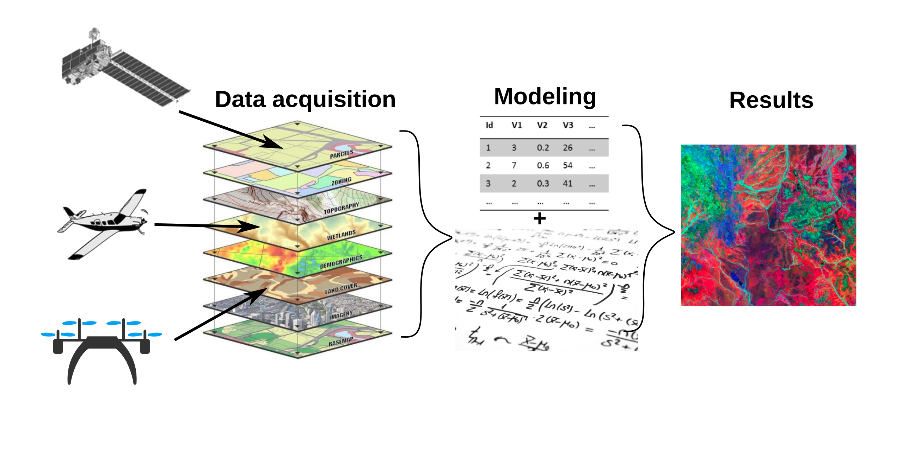
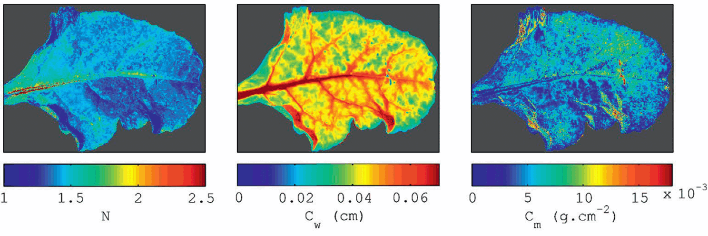
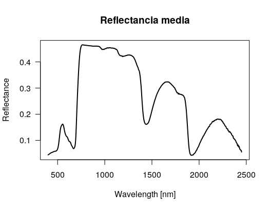
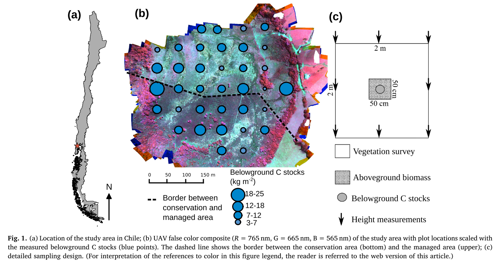
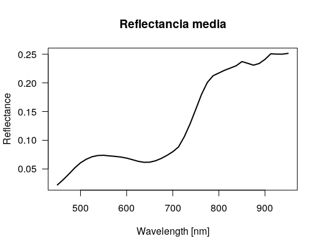

# <center> **Métodos avanzados en R** </center>

* * *

<center> En este módulo se presentan las herramientas para modelamiento avanzado de datos espaciales. El módulo contempla ejemplos prácticos de preprocesamiento de datos, exploración de datos, y modelos predictivos usando regresiones y clasificaciones.

<br/><br/>
Autor: Javier Lopatin F., Ph.D. | javierlopatin@gmail.com
<br/><br/>

</center>

* * *



## 1. Presentación del módulo

Todos los días nos enfrentamos a preguntas y decisiones que debemos tomar. Mientras sea posible, es mejor decidir cuando uno tiene buena información, ¿no?. Cuando se trabaja con datos espaciales, la estadística proporciona las herramientas que necesitamos para enfrentarnos a estos problemas y preguntas de manera informada.

En nuestro quehacer diario normalmente todos trabajamos con poblaciones de datos, lo que quiere decir que casi nunca tenemos la cantidad ni calidad de datos que esperamos. Por esta razón lo más común es obtener la mayor cantidad y calidad de datos posibles, de manera que estos sean lo más representativos de la realidad.

Una vez que ya tenemos los datos, normalmente tenemos información espacialmente incompleta que nos gustaría interpretar y extrapolar a otras zonas o regiones del espacio. Para esto utilizamos un modelo estadístico, donde la variable de interés (o variable observada) es predicha utilizando una o más variables predictoras. Un modelo predictivo puede ser entendido como "_una simplificación de la realidad_" o "_el proceso de desarrollo de una herramienta o modelo matemático que genera una predicción precisa_".

En este módulo vamos a utilizar distintos métodos de exploración de datos y _machine learning_ para analizar, interpretar, predecir, y validar nuestros datos espaciales. El siguiente es un listado de las etapas que suelen formar parte de la mayoría de problemas de modelos predictivos:

- Definir el problema: ¿Qué se pretende predecir? ¿De qué datos se dispone? o ¿Qué datos es necesario conseguir?

- Explorar y entender los datos que se van a emplear para crear el modelo.

- Métrica de existo: definir una forma apropiada de cuantificar cómo de buenos son los resultados obtenidos.

- Preparar la estrategia para evaluar el modelo: separar las observaciones en un conjunto de entrenamiento, un conjunto de validación (este último suele ser un subconjunto del de entrenamiento) y un conjunto de test. Ninguna información del conjunto de test debe participar en el proceso de entrenamiento del modelo.

- Preprocesar los datos: aplicar las transformaciones necesarias para que los datos puedan ser interpretados por el algoritmo predictivo.

Ajustar un primer modelo capaz de superar unos resultados mínimos. Por ejemplo, en problemas de clasificación, el mínimo a superar es el porcentaje de la clase mayoritaria (la moda).

- Gradualmente, mejorar el modelo optimizando sus hiperparámetros.

- Evaluar la capacidad del modelo final con el conjunto de test para tener una estimación de la capacidad que tiene el modelo cuando predice nuevas observaciones.


El módulo se estructura de la siguiente manera:

-   Métodos exploratorios
-   Métodos predictivos

<p align="center">
  
</p>

## 2. Datos de ejemplo

<p align="center">
  
</p>


En este módulo vamos a utilizar dos tipos de datasets como ejemplos: (1) datos foliares de pigmentos con datos hiperespectrales tomados por espectroscopia de campo, y (2) datos de cobertura de especies y propiedades aéreas y subterráneas de una turbera en Chiloé (Senda Darwin), junto con datos hiperespectrales adquiridos desde un _drone_ (_UAV_):

-   El primer _dataset_ contiene datos de rasgos de plantas a nivel de hoja y reflectancia obtenida por espectroscopia de campo. Los rasgos incluyen mediciones de clorofila total (Cab), carotenoides (Car), contenido de agua de la hoja (Cw), masa de la hoja por área (Cm), y parámetro de estructura de la hoja (N). Estos rasgos son muy importantes, ya que son algunas de las variables que influencian directamente en la reflectancia de la vegetación. Por lo tanto, diferencias en estos parámetros son los que nos permiten diferenciar e.j. entre especies, tipos vegetales, predecir biomasa, etc.

      Los datos corresponden a un experimento realizado en Francia el año 2003, el cual contiene **276** mediciones de reflectancia y rasgos para 49 especies vegetales distintas. Los datos se encuentran libremente disponibles en este [enlace](https://ecosis.org/package/angers-leaf-optical-properties-database--2003-). La siguiente tabla nuestra un resumen de las variables:

      <br/><br/>

      | Parámetro | Abreviación | Unidad | Rango de valores |
      | - | - | - | - |
      | Clorofila total (a + b) | Cab | g/cm | 0.78 – 106.72 |
      | Carotenoides | Car | g/cm | 0 – 25.28 |
      | Contenido de agua foliar | Cw | g/cm | 0 – 0.03|
      | Contenido de materia seca | Cm | g/cm | 0 – 0.03 |
      | Parámetro de estructura | N | - | 0 – 25.28 |

      <br/><br/>

      La reflectancia esta con resolución de 1 nm, con un rango entre 400 – 2450 nm. Es decir, son 2051 bandas! Como todavía no han visto el módulo de procesamiento hiperespectral, no se preocupen por la gran cantidad de datos y de su preprocesamiento. Asumamos por el momento que cada banda es una variable independiente. Carguen los datos en R de la siguiente manera:

    ```R
    # datos de rasgos de hojas + reflectancia
    data1 = read.csv('angers-leaf-optical-properties-database—2003.csv')

    # solamente utilizar los datos de reflectancia, los de transmitancia no los utilizaremos.
    data1 = data[data$Measurement_type == 'reflectance', ]

    # obtener los los rasgos y cambiar el nombre de las columnas
    traits = data1[c(2,4,7,9,15)]
    colnames(traits) = c('Car', 'Cab', 'Cw', 'Cm', 'N')

    # obtener la reflectancia
    reflec = data1[, 22:ncol(data1)]

    # hagamos un gráfico de la reflectancia media solo para visualización
    plot(seq(400,2450), colMeans(reflec), type='l', las=1, lwd=2, ylab='Reflectance',
        xlab='Wavelength [nm]', main="Reflectancia media")
    ```

<p align="center">
  
</p>

-   El segundo _dataset_ corresponde a mediciones de campo de composición de especies (cobertura), biomasa aerea (kg/m<sup>-2</sup>), riqueza de especies, y carbono total (kg/m<sup>-2</sup>) en una turbera de Chiloé localizada en el centro de investigación Senda Darwin. Los datos de campo fueron tomados en 2014 por [Cabezas et al. (2015)](http://doi.wiley.com/10.1890/ES15-00232.1), y contienen 44 puntos de muestreo. Posteriormente, un vuelo con _drone_ con un sensor hiperespectral de 41 bandas entre los 450 – 950 nm fue obtenido en 2016 por [Lopatin et al. (2019)](https://doi.org/10.1016/j.rse.2019.111217). Como el vuelo no cubrió la totalidad de la tubera, solo 36 puntos de muestreo contienen datos de reflectancia. Carguen los datos en R de la siguiente manera:

<p align="center">
  
</p>

```R
# cargar datos de biomasa, altura de vegetación, y carbono total a nivel de plot
data2 = read.csv('Peatland.csv')

# cargar datos de cobertura de especies
cov_data = read.csv('Cover_spp_peatland.csv')

# cargar datos de teledetección
RS = read.csv('Peatland_RSdata.csv')

# gráfico de reflectancia para visualización
plot(seq(450,950,12.5), colMeans(RS)[2:ncol(RS)], type='l', las=1, lwd=2,
    ylab='Reflectance', xlab='Wavelength [nm]', main="Reflectancia media")
```

<p align="center">
  
</p>

## 3. Tipos de análisis de datos

Hay diferentes métodos disponibles para analizar datos espaciales. Estos pueden organizarse de acuerdo a diversos criterios, como el objetivo de la técnica (ej., explorar la varianza, interpretar las relaciones, discriminar grupos, comprobar la significación estadística), el tipo de problema matemático (ej., regresión, ordenación, calibración, clasificación), o el tipo del algoritmo (ej., modelos lineales, no-lineales, _machine learning_) [(Ter Braak & Prentice 1988)](https://www.sciencedirect.com/science/article/pii/S006525040860183X). Es difícil lograr una separación clara de los métodos, ya que la misma técnica puede utilizarse para varios propósitos diferentes, y muchos enfoques están matemáticamente relacionados. Aquí, hemos decidido separar los métodos de análisis de datos en dos categorías basadas en el objetivo principal de investigación: (1) métodos exploratorios y (2) métodos predictivos.
