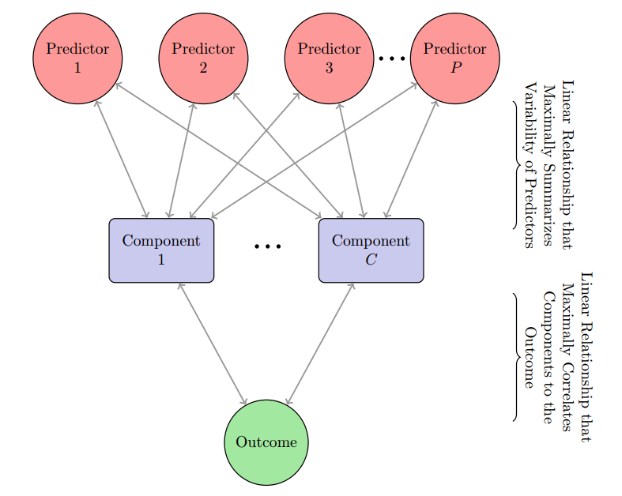
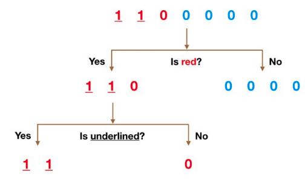
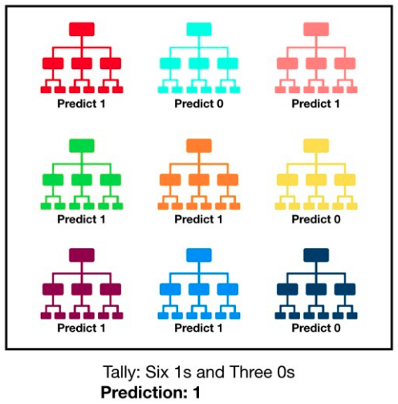
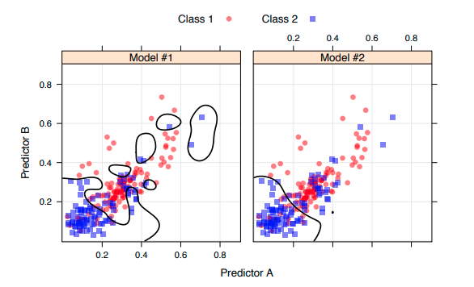
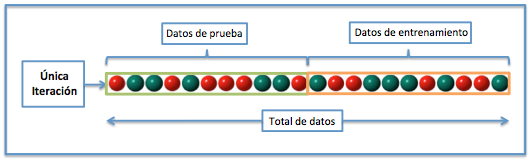
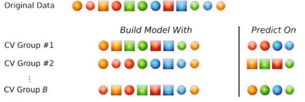
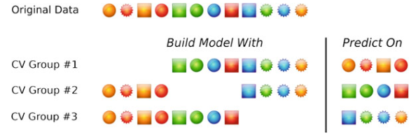
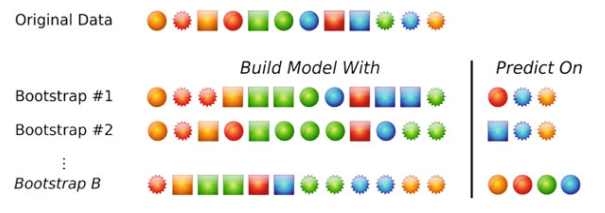

## 5. Modelos predictivos con _Machine Learning_ y caret

<p align="right">
  
</p>

Durante los últimos años, el interés y la aplicación de _machine learning_ ha experimentado tal expansión, que se ha convertido en una disciplina aplicada en prácticamente todos los ámbitos de investigación académica e industrial. El creciente número de personas dedicadas a esta disciplina ha dado como resultado todo un repertorio de herramientas con las que, perfiles con especialización media, consiguen acceder a métodos predictivos potentes. El lenguaje de programación **R** es un ejemplo de ello.

El término _machine learning_ engloba al conjunto de algoritmos que permiten identificar patrones presentes en los datos y crear con ellos estructuras (modelos) que los representan. Una vez que los modelos han sido generados, se pueden emplear para predecir información sobre hechos o eventos que todavía no se han observado. Es importante recordar que, los sistemas de _machine learning_, solo son capaces de memorizar patrones que estén presentes en los datos con los que se entrenan, por lo tanto, solo pueden reconocer lo que han visto antes. Al emplear sistemas entrenados con datos pasados para predecir futuros se está asumiendo que, en el futuro, el comportamiento será el mismo, cosa que no siempre ocurre.

Dentro de los modelos predictivos, vamos a separar estos en dos grupos de acuerdo a si buscan predecir (1) valores continuos de una variable, o (2) valores discretos o clases de una variable. Estos se denominan modelos de **regresión** y **clasificación**, respectivamente.


### 5.1. Paquete caret

Hay muchas funciones diferentes para modelar datos espaciales en **R**. En muchos casos, cada paquete o función tiene una manera distinta de ingresar o analizar los datos. Por esta razón, en este módulo utilizaremos el paquete [``caret``](https://topepo.github.io/caret/), el cual es una interfaz que unifica bajo un único marco cientos de funciones de distintos paquetes (lista [aquí](https://topepo.github.io/caret/available-models.html)), facilitando en gran medida todas las etapas de de preprocesamiento, entrenamiento, optimización y validación de modelos predictivos. Existen otros proyectos similares y muy prometedores como ``mlr``, pero nosotros revisaremos unicamente ``caret`` en esta oportunidad. Para instalar ``caret`` utiliza la herramienta de RStudio o el siguiente código:

```R
# Instalación de los paquetes que unifica caret. Esta instalación puede tardar.
# Solo es necesario ejecutarla si no se dispone de los paquetes.
install.packages("caret", dependencies = c("Depends", "Suggests"))
```

### 5.2. Algoritmos

En este módulo, vamos a ver en detalle cuatro algoritmos distintos: _Partial Least Square_ (_PLS_), _Support Vector Machines_ (_SVM_), Redes Neuronales o _Neural Networks_ (_NN_), y _Random Forest_ (_RF_). Estos funcionan de manera distinta entre si, y pueden ser agrupados de manera distinta:

A. Tipo de algoritmo
- Modelos lineales: _PLS_
- Modelos no-lineal: _SVM_, _RF_, _NN_

B. Tipo de reducción de dimensionalidad
- Modelos con selección de variables (_Feature Selection_): son aquellos modelos que reducen dimensionalidad de los datos seleccionando predictores, sin alterar su información; _SVM_, _RF_, _NN_
- Modelos de extracción de variables (_Feature Extraction_): son aquellos modelos que reducen dimensionalidad de los datos mediante métodos de ordenación, es deir transforman la información original de los predictores; _PLS_.

Glosario de términos a usar:
- Hiperparámetro (_hiperparameters_)
- Selección de variables (_variable selection_)
- Importancia de variables (_variable importance_)
- Sobreajuste (_overfitting_)
- Colinealidad (_colineality_)
- Residuos (_residuals_)
- Autocorrelación espacial (_spatial autocorrelation_)

#### 5.2.1. _Partial Least Square_ (_PLS_)

El método _Partial Least Squares_ (_PLS_) crea componentes lineales de las variables predictivas mediante _ordination_. Funciona de manera similar a _PCA_ en su método de reducción, pero utiliza la información de la variable respuesta (_Y_) para maximizar lo mas posible la varianza de los predictores (_X_). La diferencia reside en que, mientras _PCA_ ignora la variable respuesta _Y_ para determinar las combinaciones lineales, PLS busca aquellas que, además de explicar la varianza observada de _X_, predicen _Y_ lo mejor posible. Puede considerarse como una versión supervisada de _PCA_ para predicción. Por lo mismo, en general _PLS_ guarda mejor información para predicción que _PCA_ en pocos componentes.

_PLS_ es utilizado enormemente en estudios con datos de teledetección ya que reduce eficientemente la información con altos grados de colinealidad (i.e., _colineality_; comparten mucha información similar entre si), como por ejemplo las bandas espectrales.  Antes de utilizar _PLS_, los predictores deben ser normalizados, especialmente las variables están en unidades distintas Similar a _PCA_. Si no se hece esto, _PLS_ podría dar mas importancia simplemente a variables con mayor varianza. Por lo tanto, los predictores deben ser adecuadamente preprocesados antes de realizar el _PLS_.

Al igual que mucho métodos lineales, PLS esta sujeto a problemas de sobreajuste (_overfitting_) si muchas variables son incliidas durante el modelamiento.

Para mas información respecto a _PLS_, ver [este video](https://www.youtube.com/watch?v=WKEGhyFx0Dg) con un ejemplo práctico.

**Paquetes y funciones**
La funcion básica de _PLS_ utiliza la función  ``plsr`` del paquete ``pls``.

**Hiperparámetros**:
- ``ncomp``: número de componentes a incluir.

**Importancia de las variables en _caret_**: Como _PLS_ hace componentes lineales de todos los predictores,  la importancia individual de cada variable va a depender del número de componentes que se seleccione. Al igual que en _PCA_, en _PLS_ se pueden obtener los pesos (_weights_) de cada variable en cada componente. Luego, la importancia de cada variable sería una suma ponderada de los pesos de cada variable.

<p align="center">
  
</p>


#### 5.2.2. _Support Vector Machines_ (_SVM_)

Las máquinas de soporte vectorial (_Support Vector Machine, SVM₎ es un algoritmo de clasificación y regresión muy flexible y poderoso. _SVM_ busca la separación (clasificación) o relación (regresión) lineal entre las variables predictivas y las observadas mediante la transformación lineal o no-lineal de los datos a un determinado hiperplano que maximice la linealidad predictiva. Este hiperplano es construido mediante funciones denominadas _kerner_. Existen _kernels_ muy complejos que podrían llevar a los datos a un espacio _N_-dimensional hasta encontrar una relación lineal entre los predictores y los observados.


**Paquetes y funciones**
Existen muchos topod de _SVM_, segun el _kernel_ que se utilice. Algunos de los _kernels_ mas usados son: lineares, polinómicos, y de bases radiales. A modo de ejemplo, vamos a utilizar el _kernel_ _radial basis_ (_RBF_), el cual es uno de los mas utilizados en teledetección. El método ``svmRadial`` de ``caret`` emplea la función ``ksvm()`` del paquete ``kernlab``.

Mas información sobre _SVM_ puede ser vista en esta serie de [videos](https://www.youtube.com/watch?v=PDcXbbCge0E&list=PLC0PzjY99Q_Xc5IK-UE4FX7Loz1auXylY). Ejemplos particulares de _BRF_ se pueden ver en [estos videos](https://www.youtube.com/watch?v=Z2_yh2sice8&list=PLC0PzjY99Q_Xc5IK-UE4FX7Loz1auXylY&index=13).


**Hiperparámetros**:
- ``sigma``: coeficiente del kernel radial.
- ``C``: penalización por violaciones del margen del hiperplano.

<p align="center">
  
</p>


#### 5.2.3. _Random Forest_ (_RF_)

El método de _random forest_ es un algoritmo no-lineal basado en árboles de decisión. Los métodos estadísticos basados en árboles engloban a un conjunto de técnicas supervisadas no paramétricas que consiguen segmentar el espacio de los predictores en regiones simples, dentro de las cuales es más sencillo manejar las interacciones.

_RF_ crea una gran cantidad de árboles de decisión usando separaciones de datos en base a _bagging_, diminutivo de _bootstrap aggregation_, o muestreo repetido (_bootstrapping_; lo vamos a ver mas adelante) con el fin de reducir la varianza de los datos en cada segmento. Cada segmento de datos debe estar lo menos correlacionado con el resto posible, de manera que cada segmento contenga información única. Luego, en cada segmento el algoritmo busca predecir (regresión) o separar las clases (clasificación) de acuerdo a arboles de decisión:

<p align="center">
  
</p>

Como cada conjunto de datos es aleatorio y levemente distinto, cada árbol puede que resultar en valores distintos. _RF_ luego hace un ensamblaje de todas las predicciones de acurdo a un sistema de votos:

<p align="center">
  
</p>

La baja correlación entre los modelos es la clave: los modelos no correlacionados pueden producir predicciones emsambladas más precisas que cualquiera de las predicciones individuales. La razón de este maravilloso efecto es que los árboles se protegen unos a otros de sus errores individuales (siempre que no se equivoquen constantemente todos en la misma dirección). Mientras que algunos árboles pueden estar equivocados, muchos otros árboles estarán en lo cierto, por lo que como grupo los árboles son capaces de moverse en la dirección correcta.

**Hiperparámetros**:
- ``mtry``: número de predictores seleccionados en cada iteración.


## 6. Métodos de validación y métricas de ajuste

Antes de crear un modelo predictivo, hay que pensar como este modelo se va a validar y como vamos a medir el nivel de éxito del modelo. Los pasos comunes durante la construcción del modelo son:

- Estimar los parámetros del modelo (i.e., los modelos de entrenamiento)
- Determinar los valores de los parámetros de entrenamiento que no pueden ser directamente (i.e., hiperparametros)
- Calcular el rendimiento del modelo final que predice nuevos datos

¿Cómo usamos los datos para encontrar un modelo óptimo? Normalmente dividimos los datos en un conjunto de datos de entrenamiento y validación (o test):
- Datos de entrenamiento (_train data_): estos datos se utilizan para estimar los parámetros del modelo y para elegir los valores de los hiperparametros el modelo.
- Datos de validación o test (_test or validation data_): estos datos se utilizan para obtener una evaluación independiente de la eficiencia del modelo. No deben utilizar durante el entrenamiento del modelo.

Cuantos más datos usemos, mejores estimaciones obtendremos (siempre que los datos no tengan errores). Dada una cantidad fija de datos:
- Demasiados datos de entrenamiento no nos permitirá obtener una buena evaluación de rendimiento predictivo, ya que se utilizan los datos de validación para esto. Podríamos obtener un modelo que se ajuste a los datos de entrenamiento, pero no es generalizable a nuevos datos (**sobreajuste**).
- Demasiados datos de validación no nos permitirá obtener una buena evaluación de los parámetros del modelo, encontrados con los datos de entrenamiento.


### 6.1. División de datos

Hay unas cuantas formas de hacer la división de los datos: muestreo aleatorio simple, muestreo estratificado basado en el resultado, por fecha, y métodos que se centran en la distribución de los predichos.

La función ``sample`` de R puede utilizarse para crear una muestra completamente aleatoria de los datos. El paquete ``caret`` tiene una función ``createDataPartition`` que realiza otras divisiones de datos dentro de grupos de los datos. Una buena división de datos significa:

- Para clasificación, un muestreo uniforme dentro de las clases para preservar la distribución del resultado en los conjuntos de entrenamiento y validación
- Para regresión, la función determina los cuantiles de la variable observada y obtiene muestras dentro de esos grupos.

### 6.2. Sobreajuste
Se produce cuando un modelo capta de forma inapropiada las tendencias del conjunto de entrenamiento, por lo que predice de manera errónea en el conjunto de validación. Esto puede ocurrir aunque el modelo muestre buenos ajustes en los datos de entrenamiento.

Por ejemplo, en la siguiente figura se muestra un modelo 1 que esta sobreajustado al encontrar una separación entre la clase azul y la roja. Al ajustar mal los hiperparametros del modelo, se obtuvo una separación entre clases que es demasiado especifica a los datos de entrenamiento (ver círculos aislados). Es altamente probable que ese mismo modelo no se ajuste bien a cualquier otro set de datos.  El modelo 2 por el otro lado, hace una separación mas simple (quizás con ajustes de éxito menores al modelo 1 según los datos de entrenamiento) que es probable que se ajuste mejor a nuevos datos (de validación o predicciones en otras áreas). Es por esto que la validación se hace **SIEMPRE** con datos que no se utilizan en la construcción del modelo (i.e., el ajuste del modelo 2 es mucho mejor que el del modelo 1 si se usan datos de validación independiente).

<p align="center">
  
</p>


### 6.2. Validación simple

Este es el método mas básico, y consiste en separar los datos en un porcentaje para entrenamiento y un porcentaje para validación. Este método debería usarse unicamente cuando se tiene una gran cantidad de observaciones, ya que se asume que la aleatoriedad de la selección es representativa del conjunto de datos, lo cual muchas veces no es cierto. Es por eso que se recomienda usar métodos que incluyan repetición, como los que se presentan a continuación, para incluir en algún momento todas las observaciones en el proceso de entrenamiento y validación.

<p align="center">
  
</p>

Esta validación se puede hacer simplemente con la función ``sample()`` para una división 100% aleatoria, o con la función ``createDataPartition`` para estratificar la división según la distribución de los datos. La función tiene los siguientes parametros:

```
createDataPartition(y, times = 1, p = 0.5, list = TRUE, groups = min(5, length(y)))
```
donde:

- ``y``: vector con la variable observada a predecir. El vector se usa para partir las observaciones de manera equilivrada.
- ``times``: número de particiones a crearce.
- ``p``: porcentaje de los datos que se asigna a entrenamiento (0-1).
- ``list``: logical - si los resultados se van presentar en una lista (TRUE) o en una matriz con un número de filas igual a floor(p * length(y)) y columnas igual a el valor de ``times``.
- ``groups``: para ``y`` de tipo númerico, el número de divisiones en los quantiles.

Ejemplo:

```R
# suponiendo que la partición es para predecir la biomasa del dataset 2
# 70% para entrenar y 30% para validar
split = createDataPartition(y=data2$Biomasa, p=0.7, list=F)

# partición para entrenar
data_train <- data2[split, ]
# partición para validar
data_test  <- data2[-split, ]
```

### 6.3. Separación aleatoria repetitiva

Este método se denomina _leave-group-out_ o _Monte Carlos_, y selecciona una determinada porción de los datos para entrenar y validar el modelo (ej., 80/20 %) de manera aleatoria (i.e., igual a la validación simple). Esto se repite muchas veces, y el promedio de los modelos se utiliza. La diferencia básica con _K_-fold, es que como cada iteración el completamente aleatoria, hay observaciones que se pueden repetir para validar entre grupos. El número de repeticiones o iteraciones puede ser cualquiera, ya que las repeticiones no se relaciona el número de observaciones. Con muchas repeticiones (ej., 100), el modelo generalmente genera predicciones con menos varianza. En general suele generar un poco mas de sesgo que _K_-fold.

<p align="center">
  
</p>

Esta separación de datos se hace con la misma función ``createDataPartition``, pero utilizando un número de ``times`` mayor a 1. Ejemplo:

```R
split = createDataPartition(y=data2$Biomasa, p=0.7, times = 10)
# revisar los datos de entrenamiento
str(split)
```

```
> str(split)
List of 10
 $ Resample01: int [1:28] 1 2 3 4 5 6 8 11 12 13 ...
 $ Resample02: int [1:28] 1 3 4 5 6 7 8 10 11 12 ...
 $ Resample03: int [1:28] 1 3 5 6 7 9 10 11 13 14 ...
 $ Resample04: int [1:28] 2 4 5 7 8 9 10 11 12 13 ...
 $ Resample05: int [1:28] 2 3 4 5 6 7 10 11 12 13 ...
 $ Resample06: int [1:28] 2 5 6 7 8 9 10 11 12 13 ...
 $ Resample07: int [1:28] 1 2 4 5 7 8 10 11 12 13 ...
 $ Resample08: int [1:28] 1 2 3 4 5 9 10 12 14 15 ...
 $ Resample09: int [1:28] 1 2 3 4 5 6 7 8 10 12 ...
 $ Resample10: int [1:28] 1 2 5 6 7 8 9 10 12 13 ...
```

```R
# para dividir los datos usando la primera división
data_train <- data2[split[[1]], ]
data_test  <- data2[-split[[1]], ]
```

### 6.4. Validación cruzada _K_-fold

Aquí, dividimos aleatoriamente los datos en _K_ distintos bloques de aproximadamente el mismo tamaño.
- Dejamos fuera el primer bloque de datos y ajustamos un modelo.
- Este modelo se utiliza para predecir el bloque de datos de validación (_hold-on_)
- Continuamos este proceso hasta que hayamos predicho en los _K_  bloques de validación

El rendimiento final se basa en las _K_ predicciones de validación. Generalmente se eligen valores de _K_ de 5 o 10. Mientras mas grande el número de _K_, mas bloques de datos se utilizan, y menos datos de validación quedaran en cada bloque. Por ejemplo, si de un total de 12 observaciones se elige un _K_ = 3, significa que las 12 observaciones se van a separar en 3 bloques, dando de 4 observaciones por bloque (12/3 = 4). Se van a ajustar por lo tanto tres modelos, utilizando dos bloques como entrenamiento (8 datos) y un bloque para validar (4 datos). Ver el ejemplo en a figura de abajo. En este caso particular, un _K_ muy alto podría dejan muy pocos datos para una buena validación. Este método se utiliza para tener una distribución de valores de ajuste (3 en este ejemplo).

Los _K_-fold repetitivos (_repeated K-fold_) crean múltiples versiones de los bloques, y el modelo final será la combinación de los modelos. Por ejemplo, si el modelo de la figura (_K_ = 3) se repite 5 veces, se tendrían al final 3*5 = 15 datos de validación. Recuerden que los bloques son elegidos de forma aleatoria, por los bloques serán levemente distinto entre si.

_Leave-one-out_ (LOO) es un caso especial de _K-fold_, donde _K_ = 1. En general es menos robusto que _K_ = 5 o 10, pero puede ser una buena alternative si los datos utilizados tienen pocas observaciones.


<p align="center">
  
</p>


Esta división de datos se puede crear utilizando la función ``createFolds`` o la ``createMultiFolds`` para _K_-fold con repetición. Las funciones tienes los siguientes parametros:

```
createFolds(y, k = 10, list = TRUE, returnTrain = FALSE)
createMultiFolds(y, k = 10, times = 5)
```

donde:

- ``y``: vector con la variable observada a predecir. El vector se usa para partir las observaciones de manera equilivrada.
- ``k``: número de particiones.
- ``list``: logical - si los resultados se van presentar en una lista (TRUE) o en una matriz con un número de filas igual a floor(p * length(y)) y columnas igual a el valor de ``times``.
- ``returnTrain``: logical - si = ``TRUE``, los valores devueltos corresponden a las observaciones seleccionadas para ser usadas en entrenamiento. Solo funciona si ``list = TRUE``.
- ``times``: número de particiones a crearce.

Ejemplo:

```R
# K-fold data split con k=10
split = createFolds(y =data2$Biomasa, k = 10, returnTrain = T)
# revisar los datos de entrenamiento
str(split)
```

```
> str(split)
List of 10
 $ Fold01: int [1:33] 1 2 3 4 5 7 8 9 10 11 ...
 $ Fold02: int [1:32] 1 2 3 4 5 6 7 8 9 10 ...
 $ Fold03: int [1:32] 1 2 3 4 5 6 7 8 9 10 ...
 $ Fold04: int [1:32] 1 2 3 4 5 6 7 9 10 11 ...
 $ Fold05: int [1:33] 1 2 3 4 5 6 8 9 10 11 ...
 $ Fold06: int [1:32] 1 2 3 4 6 7 8 10 11 12 ...
 $ Fold07: int [1:33] 2 4 5 6 7 8 9 10 11 12 ...
 $ Fold08: int [1:32] 1 2 3 5 6 7 8 9 10 11 ...
 $ Fold09: int [1:32] 1 2 3 4 5 6 7 8 9 11 ...
 $ Fold10: int [1:33] 1 3 4 5 6 7 8 9 10 11 ...
```

```R
# para dividir los datos usando la primera división
data_train <- data2[split[[1]], ]
data_test  <- data2[-split[[1]], ]
```

### 6.5. _Bootstrapping_

Es básicamente muy parecido a la separación aleatoria repetitiva, con la diferencia de que las selección aleatoria de observaciones es por el mismo número total de observaciones que se tiene, y esta selección es con remplazo. En el ejemplo de la figura se eligen aleatoriamente con remplazo 12 observaciones, de las cuales algunas observaciones serán elegidas mas de una vez y algunas no serán elegidas.

En general, cerca del 63% de las observaciones son utilizadas para entrenamiento y 27% para validar en cada iteración. Este método es particularmente atractivo si se tienen pocas observaciones, ya que se mantiene este número para entrenar modelos de forma constante. El igual que el método de separación aleatoria repetitiva, _bootstrapping_ puede resultar en un modelo con mas sesgo que _K_-fold.


<p align="center">
  
</p>

La función que se utiliza se llama ``createResample``:

```
createResample(y, times = 10, list = TRUE)
```

donde:

- ``y``: vector con la variable observada a predecir. El vector se usa para partir las observaciones de manera equilivrada.
- ``times``: número de particiones a crearce.
- ``list``: logical - si los resultados se van presentar en una lista (TRUE) o en una matriz con un número de filas igual a floor(p * length(y)) y columnas igual a el valor de ``times``.

Ejemplo:

```R
# bootstrapping con 10 repeticiones
createResample(y, times = 10, list = TRUE)
# revisar los datos de entrenamiento
str(split)
```

```
> str(split)
List of 10
 $ Resample01: int [1:36] 2 3 3 3 5 5 5 6 6 8 ...
 $ Resample02: int [1:36] 1 3 3 4 5 5 6 7 7 8 ...
 $ Resample03: int [1:36] 2 4 4 5 7 8 10 11 13 16 ...
 $ Resample04: int [1:36] 1 3 3 4 4 4 5 6 6 8 ...
 $ Resample05: int [1:36] 1 1 3 3 5 5 6 8 8 9 ...
 $ Resample06: int [1:36] 1 1 2 2 2 2 3 3 3 6 ...
 $ Resample07: int [1:36] 1 2 4 5 6 8 9 9 10 13 ...
 $ Resample08: int [1:36] 1 1 2 2 5 6 7 7 7 7 ...
 $ Resample09: int [1:36] 1 3 3 3 4 4 6 7 8 9 ...
 $ Resample10: int [1:36] 1 2 2 2 2 3 4 4 4 6 ....
```

```R
# para dividir los datos usando la primera división
data_train <- data2[split[[1]], ]
data_test  <- data2[-split[[1]], ]
```

### 6.6. Validación estratificada y bloqueada

Al utilizar cualquiera de estos tipos de validación, es importante que durante la separación de los datos de entrenamiento y validación, cada separación sea lo mas representativa de la varianza total de los datos. De esta manera cada modelo entrenado y valores predichos tendrán menos error. ``caret`` se hace cargo de esto, como se explico previamente, integrando segmentación por cuantiles o por clases. Si embargo, hay algunos ejemplos donde se debe hacer algo distinto, llamado validación bloqueada.

Esto se utiliza cuando hay observaciones que están muy correlacionadas entre si, y no queremos que estas observaciones sean aleatoreamente separadas. Por ejemplo, si se tienen mediciones de humedad del suelo de varios años consecutivos (ej., punto1-año1, punto1-año2, punto1-año3, etc), es muy probables que todas las mediciones hechas en un mismo punto estén altamente correlacionadas, ya que tienen la misma coordenada geográfica. Si usamos algunas de estas observaciones para entrenar un modelo, y algunas para validar, es posible que el ajuste del modelo sea demasiado optimista, simplemente por que nuestros datos de validación se parecen mucho a los entrenamiento. Es este caso, se valida por bloque, y todas las mediciones de, ej., el _punto1_ deben ser usadas o para entrenar o validar. Así sucesivamente con cada punto del espacio.

### 6.6. ¿Qué método debo seleccionar?

Esto depende de los datos que se tengan, pero sin duda una de las opciones con repetición si es posible. _Leve-one-out_, o _K_-fold con un K = 1, sería la opción mas básica y con menos requerimientos computacionales. Sin embargo, esta puede dar resultados menos robustos. Si se tienen pocos datos (ej., 30-60), en mi opinión bootstrapping es una buena opción, ya que el número total de las observaciones se mantiene durante el entrenamiento. Sin embargo, seria recomendable hacer muchas repeticiones de modelos (ej., 100-500) para obtener una buena distribución de posibles resultados, lo cual podría llevar mas tiempo de procesamiento.

Por el contrario, si el número de observaciones es grande (ej., mas de 100), K-fold con _K_=10 (ojalás con repeticiones) es la opción más recomendable.

## 7. Entrenar un modelo predictivo

Para entrenar un modelo predictivo y encontrar los mejores valores de sus hiperparámetros con ``caret`` se utiliza la función ``train()``. Las funciones tienes los siguientes parametros:

```
train(
  x,
  y,
  method = "rf",
  preProcess = NULL,
  ...,
  weights = NULL,
  metric = ifelse(is.factor(y), "Accuracy", "RMSE"),
  maximize = ifelse(metric %in% c("RMSE", "logLoss", "MAE"), FALSE, TRUE),
  trControl = trainControl(),
  tuneGrid = NULL,
  tuneLength = ifelse(trControl$method == "none", 1, 3)
)
```

donde:

- ``x``: objeto con los predictores a utilizar. Las observaciones se ecuentran en las filas y las variables predictivas en las columnas. Puede ser una matriz o ``data frame``, pero las columnas deben tener nombres.
- ``y``: vector numerico o facorial (tipo ``numeric`` o ``factor``) con la variable observada a predecir. Si la variable es de tipo numerico se asume que el modelo predictivo es para regresión, mientras que si es factorial se asume que es para clasificación.

... alternativamente a ``x`` e ``y``, se puede utilizar tambien la función como formula, donde ``y ~ x``. Es ente caso se debe agregar la variable ``data`` identificando la matriz o ``data frame`` donde las variables se encuentran. Si se utiliza ``y ~ .,`` se asume que todas las variables a excepción de ``y`` son los predictores.


- ``method``: numbre (type: ``string``) del algoritmo a utilizar. Valores posibles a utilizar se pueden ver usando ``names(getModelInfo())``. A la fecha hay 238 algoritmos incluidos en el paquete. En http://topepo.github.io/caret/train-models-by-tag.html se puede ver la lista y una paqueña descripción de cada modelo. Se debe utilizar uno especificamente para regresión o clasificación dependiento del caso.
- ``preProcess``: vector (type: ``string``) definiendo un preprocesamiento para los predictores (``x``). Las posibilidades incluyen "BoxCox", "YeoJohnson", "expoTrans", "center", "scale", "range", "knnImpute", "bagImpute", "medianImpute", "pca", "ica" y "spatialSign". The default is no pre-processing. See preProcess and trainControl on the procedures and how to adjust them. Pre-processing code is only designed to work when x is a simple matrix or data frame.
- ``weights``: vector numeroco con ``case weights``. Solo para aquellos modelo que lo permitan.
- ``metric``: cadena de caracteres indicando la metrica a utilizar para encontrar los mejores hiperparámetros del modelo. Por defecto, metricas posibles son "RMSE" and "Rsquared" para regresiones, y "Accuracy" y "Kappa" para clasificaciones. Si se utilizan métricas de rendimiento personalizadas (mediante el argumento ``summaryFunction`` en ``trainControl``, el valor de la métrica debe coincidir con uno de los argumentos. Si no lo hace, se emite un aviso y se utiliza la primera métrica dada por el argumento ``summaryFunction``. (NOTA: Si se da, se debe nombrar este argumento).
- ``maximize``: logical - ¿la métrica de ajuste se debe maximizar o minimizar?
- ``trControl``: una lista con valores que definen la función elegida. Normalmente se utiliza la función ``trainControl`` para pasar este parámetro: http://topepo.github.io/caret/using-your-own-model-in-train.html.
- ``tuneGrid``: data frame con posibles valores de hiperparámetros para entrenar el modelo. La columna se debe nombrar con el/los hiperparámetro/s específicos del modelo elegido. Utilizar ``getModelInfo`` para ver la lista de hiperparámetro que necesita el modelo. Para mas información respecto a los hiperparámetros ver http://topepo.github.io/caret/available-models.html.
- ``tuneLength``: Un entero que denota la cantidad de granularidad en ``tuneGrid``. Por defecto, este argumento es el número de niveles para cada parámetro de sintonía que debe ser generado por el tren. Si ``trainControl`` tiene la opción de búsqueda = "random", éste es el número máximo de combinaciones de parámetros de sintonía que se generarán por la búsqueda aleatoria.
- ``na.action``: Una función para especificar la acción a tomar si se encuentran NAs. La acción por defecto es que el procedimiento falle. Una alternativa es na.omit, que lleva a rechazar los casos con valores faltantes en cualquier variable requerida.
- ``contrasts``: Lista de contrastes a usar para algunos o todos las variables factoriales.

### 7.1. Controlar las opciones de Validación

Una de las entradas mas importantes de ``train()`` es ``trControl``, la cual controla la mayor parte de la funcionalidad del modelo a entrenas, incluyendo el tipo de validación. Así es, es posible dividir los datos utilizando las funciones de partición que ya vimos, pero ``caret`` te permite hacer esto internamente en el modelo. Esto hace que el proceso sea mucho mas fácil, especialmente para metodos con repeticiones. Para esto se utiliza la función ``trainControl``. Esta función tiene muchos parametros. Les voy a enseñar todos, tal cual en la información de la función, pero les voy a marcar en negrita los parametros mas utilizados y mas importantes para este curso:

```
trainControl(
  method = "boot",
  number = ifelse(grepl("cv", method), 10, 25),
  repeats = ifelse(grepl("[d_]cv$", method), 1, NA),
  p = 0.75,
  search = "grid",
  initialWindow = NULL,
  horizon = 1,
  fixedWindow = TRUE,
  skip = 0,
  verboseIter = FALSE,
  returnData = TRUE,
  returnResamp = "final",
  savePredictions = FALSE,
  classProbs = FALSE,
  summaryFunction = defaultSummary,
  selectionFunction = "best",
  preProcOptions = list(thresh = 0.95, ICAcomp = 3, k = 5, freqCut = 95/5, uniqueCut =
    10, cutoff = 0.9),
  sampling = NULL,
  index = NULL,
  indexOut = NULL,
  indexFinal = NULL,
  timingSamps = 0,
  predictionBounds = rep(FALSE, 2),
  seeds = NA,
  adaptive = list(min = 5, alpha = 0.05, method = "gls", complete = TRUE),
  trim = FALSE,
  allowParallel = TRUE
)
```

donde:

- **method**: tipo de validación interna a utiliar. Las opciones son: "boot" (_bootstrapping_), "boot632" (tipo particular de _bootstrapping_), "optimism_boot" (tipo particular de _bootstrapping_), "boot_all" (tipo particular de _bootstrapping_), "cv" (_K_-fold), "repeatedcv" (_K_-fold con repeticiones), "LOOCV" (_leave-one-out_ o cv con k=1), "LGOCV" (LOOCV con repeticiones), "none" (solo ajustar un modelo con todos los datos), "oob" (folo para los métodos random forest, bagged trees, bagged earth, bagged flexible discriminant analysis, o conditional tree forest), timeslice, "adaptive_cv", "adaptive_boot" or "adaptive_LGOCV".
- **number**; número de _k_-folds o iteraciones.
- **repeats**: Número de repeticiones. Solo para "repeatedcv".
- ``p``: solo para "leave-group" cross-validation: el porcentaje de entrenamiento.
- **search**: puede ser "grid" o "random", describe como se determina ``tuneGrid``. describing how the tuning parameter grid is determined. See details below.
- ``initialWindow``, ``horizon``, ``fixedWindow``, ``skip``: posibles argumentos para ``createTimeSlices`` si el método elegido es ``timeslice``.
- ``verboseIter``: logical - imprimir la información almacenada durante el entrenamiento.
- ``returnData``: logical - guardar los datos.
- ``returnResamp``: caracteres indicando cuanto de las métricas del "resample summary" se deben guardar. Puede ser "final", "all" o "none".
- ``savePredictions``:un indicador de cuánto de las predicciones de retención para cada remuestreo debe guardarse. Los valores pueden ser "all", "final" o "none". También se puede utilizar un valor lógico que se convierte en "all" (para verdadero) o "none" (para falso). "final" guarda los valoresóptimos de los hiperparámetros.
- ``classProbs``: logical - ¿deberían calcularse las probabilidades de clase para los modelos de clasificación (junto con los valores previstos) en cada remuestreo?
- ``summaryFunction``: una función para computar la métrica de rendimiento a través de las muestras. Los argumentos de la función deben ser los mismos que los de ``defaultSummary``. Tenga en cuenta que si se utiliza el método = "oob", esta opción se ignora y se emite una advertencia.
- ``selectionFunction``: la función utilizada para seleccionar los hiperparámetros óptimos. Puede ser el nombre de la función o la función misma.
- ``preProcOptions``: Una lista de opciones para pasar el preprocesamiento de las variables predictivas. Por ejemplo, center, scaling, pca, etc.). Se pasa a través de la opción ``preProc`` de ``train()``.
- ``sampling``: un valor de carácter único que describe el tipo de muestreo adicional que se lleva a cabo después del remuestreo (generalmente para resolver desequilibrios de clase). Los valores son "none", "down", "up", "smote", or "rose". Los dos últimos valores requieren los paquetes DMwR y ROSE, respectivamente. Este argumento también puede ser una lista para facilitar el muestreo personalizado y estos detalles pueden encontrarse en el sitio web del paquete caret para el muestreo.
- ``index``: una lista con elementos para cada iteración de remuestreo. Cada elemento de la lista es un vector de números enteros que corresponden a las filas utilizadas para la formación en esa iteración.
- ``indexOut``: una lista (de la misma longitud que el ``index``) que dicta qué datos se mantienen para cada remuestreo (como números enteros). Si es NULL, entonces se utiliza el conjunto único de muestras no contenidas en el índice.
- ``indexFinal``: un vector opcional de números enteros que indica qué muestras se utilizan para ajustar el modelo final después del remuestreo. Si es NULL, entonces se utiliza todo el conjunto de datos.
- ``timingSamps``: el número de muestras del conjunto de estrenamiento que se utilizará para medir el tiempo de predicción de las muestras (el cero indica que no se debe estimar el tiempo de predicción.
- ``predictionBounds``: un vector lógico o numérico de longitud 2 (sólo regresión). Si son lógicos, las predicciones pueden limitarse a estar dentro del límite de los resultados del conjunto de entrenamiento. Por ejemplo, un valor de ``c(TRUE, FALSE)`` sólo limitaría el extremo inferior de las predicciones. Si es numérico, se pueden utilizar límites específicos. Por ejemplo, si ``c(10, NA)``, los valores por debajo de 10 se predecirán como 10 (sin restricción en el extremo superior).
- **seeds**: un conjunto opcional de números enteros que se utilizará para establecer la semilla en cada iteración de remuestreo. Esto es útil cuando los modelos se ejecutan en paralelo. Un valor de NA evitará que la semilla se fije dentro de los procesos del trabajador, mientras que un valor de NULL fijará las semillas utilizando un conjunto aleatorio de números enteros. Alternativamente, se puede utilizar una lista. La lista debería tener elementos B+1 donde B es el número de remuestreos, a menos que el método sea "boot632" en cuyo caso B es el número de remuestreos más 1. Los primeros elementos B de la lista deben ser vectores de números enteros de longitud M donde M es el número de modelos que se evalúan. El último elemento de la lista sólo tiene que ser un único número entero (para el modelo final). Véase la sección de ejemplos que figura a continuación y la sección de detalles.
- ``adaptive``: una lista utilizada cuando el método es "adaptive_cv", "adaptive_boot" o "adaptive_LGOCV". Véanse los detalles más adelante.
- ``trim``: logical - Si es cierto que el modelo final del objeto puede tener algunos componentes del objeto removidos, así que reduce el tamaño del objeto guardado. El método de predicción seguirá funcionando, pero algunas otras características del modelo pueden no funcionar. El recorte sólo se producirá en los modelos en los que se haya implementado esta característica.
- **allowParallel**: si existe instalado un packete para hacer procesamiento en paralelo, ¿debería la función utilizarlo?

### 7.2. Metricas de ajuste o performance de los modelos

Las métricas para medir el nivel de sjuste, performance, o éxito de un modelo vamos a dividirlas en dos tipos, de acuerdo a si son métricas para modelos de regresión o de clasificación.

#### 7.2.1. Métricas de regresiones

Las metricas de regresiones buscan ver cuan parecido son los valores observados versus los predichos por el modelo. 
