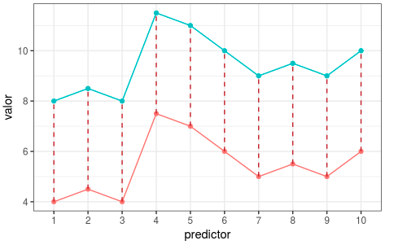
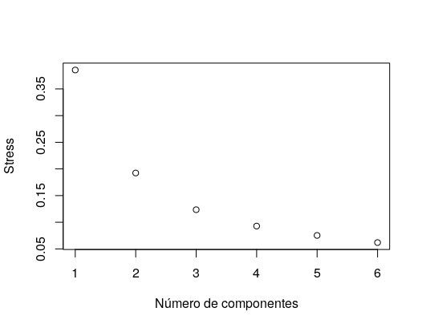

## 4. Métodos exploratorios

Se utilizan para explorar las relaciones entre **objetos** basándose unicamente en los valores de las **variables** medidas en esos objetos. Por ejemplo, las muestras de suelo (objetos) recogidas en diferentes tipos vegetacionales pueden compararse basándose en las abundancias de especies microbianas del suelo (variables) [(Hartmann et al. 2014)](https://pubmed.ncbi.nlm.nih.gov/24030594/). En esta categoría, los métodos de **clustering** y **ordination** son los mas conocidos.

Todos los métodos de _clustering_ y _ordination_ tienen una cosa en común, para poder llevar a cabo las agrupaciones necesitan definir y cuantificar la similitud entre las observaciones. El término **distancia** se emplea para cuantificar la similitud (o disimilitud; _dissimilarity_) entre observaciones. A continuación se presentan algunos de las distancias mas empleadas en estos métodos.

### 4.1. Medidas de distancia

Si se representan las observaciones en un espacio _p_ dimensional, siendo _p_ el número de variables asociadas a cada observación, cuanto más se asemejen dos observaciones, más próximas estarán. Por eso se emplea el término distancia. La característica que hace del _clustering_ un método adaptable a escenarios muy diversos es que puede emplear cualquier tipo de distancia, lo que permite al investigador escoger la más adecuada para el estudio en cuestión. A continuación, se describen algunas de las más utilizadas.

#### Distancia euclidiana

Es la distancia euclidiana entre dos puntos, definida como la longitud del segmento que une ambos puntos. En coordenadas cartesianas, la distancia euclidiana se calcula empleando el teorema de Pitágoras. Es decir, es la distancia linear mas cercana entre los dos puntos. Una forma de dar mayor peso a aquellas observaciones que están más alejadas es emplear la distancia euclidiana al cuadrado.

      En el caso del _clustering_, donde se busca agrupar observaciones que minimicen la distancia, esto se traduce en una mayor influencia de aquellas observaciones que están más distantes. La siguiente imagen muestra el perfil de dos observaciones definidas por 10 variables (espacio con 10 dimensiones). Aquí, la distancia euclidiana entre las dos observaciones equivale a la raíz cuadrada de la suma de las longitudes de los segmentos rojos que unen cada par de puntos. Tiene en cuenta por lo tanto el desplazamiento individual de cada una de las variables.


<p align="center">
  
</p>

#### Distancia de Manhattan

La distancia de Manhattan, también conocida como _taxicab metric_, _rectilinear distance_ o _L1 distance_, define la distancia entre dos puntos como la sumatoría de las diferencias absolutas entre cada dimensión. Esta medida se ve menos afectada por outliers (es más robusta) que la distancia euclidiana debido a que no eleva al cuadrado las diferencias.

      La siguiente imagen muestra una comparación entre la distancia euclidiana (segmento azul) y la distancia de manhattan (segmento rojo y verde) en un espacio bidimensional. Existen múltiples caminos para unir dos puntos con el mismo valor de distancia de manhattan, ya que su valor es igual al desplazamiento total en cada una de las dimensiones.

<p align="center">
  
</p>

#### Distancia de correlación

La correlación es una medida de distancia muy útil cuando la definición de similitud se hace en términos de patrón o forma y no de desplazamiento o magnitud. ¿Qué quiere decir esto? En la imagen del apartado de la distancia euclidiana, las dos observaciones tienen exactamente el mismo patrón, la única diferencia es que una de ellas está desplazada 4 unidades por encima de la otra. Si se emplea como medida de similitud 1 menos el valor de la correlación, ambas observaciones se consideran idénticas (su distancia es 0).

      En la siguiente imagen se muestra el perfil de 3 observaciones. Según a la distancia euclidiana, las observaciones _b_ y _c_ son las más similares, mientras que acorde a la correlación de Pearson, las observaciones más similares son _a_ y _b_.

<p align="center">
  
</p>


#### Simple matching coefficient

Cuando las variables con las que se pretende determinar la similitud entre observaciones son de tipo binario, a pesar de que es posible codificarlas de forma numérica como 1 o 0, no tiene sentido aplicar operaciones aritméticas sobre ellas (media, suma…). Por ejemplo, si la presencia y ausencia de una especie se codifica como 1 y 0, respectivamente, carece de significado decir que la media de la presencia de una especie en un determinado set de datos es 0.5. En situaciones como esta, no se pueden emplear medidas de similitud basadas en distancia euclidiana, manhattan,  o correlación.

Dado dos objetos _A_ y _B_, cada uno con _n_ atributos binarios, el simple matching coefficient (SMC) define la similitud entre ellos como  el número de coincidencias partido por el número total de atributos.

#### Índice Jaccard

El índice Jaccard o _coeficiente de correlación Jaccard_ es _similar al _simple matching coefficient_ (SMC)_. La diferencia radica en que el SMC  considera como coincidencias tanto si el atributo está presente en ambos sets como si el atributo no está en ninguno de los sets, mientras que Jaccard solo cuenta como coincidencias cuando el atributo está presente en ambos sets. Por lo tanto, la distancia de Jaccard _(1−J)_ supera a la _simple matching distance_ en aquellas situaciones en las que la coincidencia de ausencia no aporta información.

#### ¿Qué distancia seleccionar?

La distancia ideal a utilizar va a depender completamente de los datos que estamos usando. Si los datos son continuos y no presentan _outliars_ la distancia euclidiana es suficiente. En caso de que los datos presenten valores nulos (ej., presencia/ausencia de especies), entonces es mejor usar Jaccarad. De todas formas muchas veces es mejor probar varias opciones y ver se ajusta mejor a nuestros datos particulares. Por supuesto, existen muchos otros indices de distancia que pueden buscar y utilizar.

### 4.2. Clustering

El término _clustering_ es también conocido como _clasificación no supervisada_, y hace referencia a un amplio abanico de técnicas cuya finalidad es encontrar patrones o grupos discretos (clusters) dentro de un conjunto de observaciones. Las particiones se establecen de forma que, las observaciones que están dentro de un mismo grupo, son similares entre ellas y distintas a las observaciones de otros grupos. Por lo tanto, no se requiere de una variable observada y la partición de los grupos es totalmente derivada de datos.

Dada la utilidad del _clustering_ en disciplinas muy distintas, se han desarrollado multitud de variantes y adaptaciones de sus métodos y algoritmos. Pueden diferenciarse tres grupos principales:

-   _Partitioning Clustering_: Este tipo de algoritmos requieren que el usuario especifique de antemano el número de clusters que se van a crear (ej., K-means, K-medoids, CLARA).
-   _Hierarchical Clustering_: Este tipo de algoritmos no requieren que el usuario especifique de antemano el número de _clusters_ (ej., _agglomerative clustering_, _divisive clusterig_).
-   Métodos que combinan o modifican los anteriores (_hierarchical K-means_, _fuzzy clustering_, _model based clustering_, y _density based clustering_).

Como ejemplo, vamos a ver mas en detalle _K_-means, el cual es uno de los algoritmos de _clustering_ mas utilizados por su sencillez y rapidez.

#### 4.2.1. _K_-means

El método _K_-means clustering [(MacQueen, 1967)](https://projecteuclid.org/euclid.bsmsp/1200512992) agrupa las observaciones en _K_ clusters distintos, donde el número _K_ lo determina el analista antes de ejecutar del algoritmo. _K_-means clustering encuentra los _K_ mejores clusters, entendiendo como mejor cluster aquel cuya varianza interna (intra-cluster variation) sea lo más pequeña posible. Se trata por lo tanto de un problema de optimización, en el que se reparten las observaciones en _K_ clusters de forma que la suma de las varianzas internas de todos ellos sea lo menor posible. Para poder solucionar este problema es necesario definir un modo de cuantificar la varianza interna. Minimizar la suma total de varianza interna de forma exacta (encontrar el mínimo global) es un proceso complejo debido a la inmensa cantidad de formas en las que n observaciones se pueden dividir en K grupos. Sin embargo, es posible obtener una solución que, aun no siendo la mejor de entre todas las posibles, es muy buena (óptimo local). El algoritmo empleado para ello es:

#### 4.2.2. Ventajas y desventajas de _K_-means

K-means es uno de los métodos de _clustering_ más utilizados. Destaca por la sencillez y velocidad de su algoritmo, sin embargo, presenta una serie de limitaciones que se deben tener en cuenta.

-   Requiere que se indique de antemano el número de _clusters_ que se van a crear. Esto puede ser complicado si no se dispone de información adicional sobre los datos con los que se trabaja. Se han desarrollado varias estrategias para ayudar a identificar potenciales valores óptimos de _K_ (ver más adelante), aunque todas ellas son orientativas.

-   Las agrupaciones resultantes pueden variar dependiendo de la asignación aleatoria inicial de los centroides. Para minimizar este problema se recomienda repetir el proceso de _clustering_ entre 25-50 veces y seleccionar como resultado definitivo el que tenga menor suma total de varianza interna. Aun así, solo se puede garantizar la reproducibilidad de los resultados si se emplean semillas (¿Qué es una semilla? lo vamos a ver mas adelante).

-   Presenta problemas de robustez frente a _outliers_. La única solución es excluirlos o recurrir a otros métodos de _clustering_ más robustos como _K_-medoids (_PAM_).

<p align="center">
  
</p>

#### 4.2.3. Validación del _Clustering_

Los métodos de _clustering_ tienen la propiedad de encontrar agrupaciones en cualquier set de datos, independientemente de que realmente existan o no dichos grupos en la población de la que proceden las observaciones. Por ejemplo, si se aplica el mismo método a una segunda muestra de la misma población ¿Se obtendrían los mismos grupos? Además, cada uno de los métodos de _clustering_ da lugar a resultados distintos. La validación de _clusters_ es el proceso por el cual se evalúa la veracidad de los grupos obtenidos. A modo general, este proceso consta de tres partes: estudio de la tendencia de clustering, elección del número óptimo de _clusters_ y estudio de la calidad/significancia de los _clusters_ generados.

##### 4.2.3.1. Estudio de la tendencia de _clustering_

Antes de aplicar un método de _clustering_ a los datos es conveniente evaluar si hay indicios de que realmente existe algún tipo de agrupación en ellos. A este proceso se le conoce como assessing cluster tendecy y puede llevarse a cabo mediante test estadísticos (_Hopkins statistic_) o de forma visual (_Visual Assessment of cluster Tendency_).

Para ilustrar la importancia de este pre-análisis inicial, se aplica _clustering_ a dos sets de datos, uno que sí contiene grupos reales (<code>iris</code>) y otro aleatoriamente simulado que no.

```R
library(purrr)

# Se elimina la columna que contiene la especie de planta
datos_iris <- iris[, -5]

# Se generan valores aleatorios dentro del rango de cada variable. Se utiliza la
# función map del paquete purrr.
# no se preocupen por esto...realmente es para generar datos de ejemplo
datos_simulados <- map_df(datos_iris,
                          .f = function(x){runif(n = length(x),
                                                 min = min(x),
                                                 max = max(x))
                                          }
                          )

# Estandarización de los datos
datos_iris      <- scale(datos_iris)
datos_simulados <- scale(datos_simulados)
```

Una representación gráfica permite comprobar que el set de datos iris sí contiene grupos reales, mientras que los datos simulados no. Al haber más de dos variables es necesario reducir la dimensionalidad mediante un _Principal Component Analysis_ (vamos a verlo en detalle mas adelante).

```R
library(factoextra)
library(ggpubr)
pca_datos_iris      <- prcomp(datos_iris)
pca_datos_simulados <- prcomp(datos_simulados)
p1 <- fviz_pca_ind(X = pca_datos_iris, habillage = iris$Species,
                   geom = "point", title = "PCA - datos iris",
                   pallete = "jco") +
      theme_bw() + theme(legend.position = "bottom")
p2 <- fviz_pca_ind(X = pca_datos_simulados, geom = "point",
                   title = "PCA - datos simulados", pallete = "jco") +
      theme_bw() + theme(legend.position = "bottom")

ggarrange(p1, p2, common.legend = TRUE)
```

<p align="center">
  
</p>

Véase que ocurre cuando se aplican métodos de _clustering_ a estos dos sets de datos.

```R
# K-means clustering
km_datos_iris <- kmeans(x = datos_iris, centers = 3)
p1 <- fviz_cluster(object = km_datos_iris, data = datos_iris,
                   ellipse.type = "norm", geom = "point", main = "Datos iris",
                   stand = FALSE, palette = "jco") +
      theme_bw() + theme(legend.position = "none")
km_datos_simulados <- kmeans(x = datos_simulados, centers = 3)
p2 <- fviz_cluster(object = km_datos_simulados, data = datos_simulados,
                   ellipse.type = "norm", geom = "point",
                   main = "Datos simulados", stand = FALSE, palette = "jco") +
      theme_bw() + theme(legend.position = "none")
```

<p align="center">
  
</p>

_K_-means crea agrupaciones en el set de datos simulados, a pesar de tener mucho sobrelape entre clases. De no analizarse con detenimiento, podrían darse por válidos estos grupos aun cuando realmente no existen. A continuación, se muestran dos métodos que ayudan a identificar casos como este y prevenir la utilización de _clustering_ en escenarios en los que no tiene sentido hacerlo.

##### Hopkins statistics

El estadístico _Hopkins_ (_H_) permite evaluar la tendencia de _clustering_ de un conjunto de datos mediante el cálculo de la probabilidad de que dichos datos procedan de una distribución uniforme, es decir, estudia la distribución espacial aleatoria de las observaciones. Valores de H en torno a 0.5 indican que los _clusters_ son  muy cercanos el uno al otro, es decir, que los datos estudiados se distribuyen uniformemente y que por lo tanto no tiene sentido aplicar _clustering_. Cuanto más se aproxime a 0 el estadístico H, más evidencias se tienen a favor de que existen agrupaciones en los datos y de que, si se aplica clustering correctamente, los grupos resultantes serán reales. La función <code>hopkins()</code> del paquete <code>clustertend</code> permite calcular el estadístico _Hopkins_.

```R
library(clustertend)
set.seed(321)

# Estadístico H para el set de datos iris
hopkins(data = datos_iris, n = nrow(datos_iris) - 1)
```

    ## $H
    ## [1] 0.1842089

```R
# Estadístico H para el set de datos simulado
hopkins(data = datos_simulados, n = nrow(datos_simulados) - 1)
```

    ## $H
    ## [1] 0.510135

Los resultados muestran evidencias de que las observaciones del set de datos <code>iris</code> no siguen una distribución espacial uniforme, su estructura contiene algún tipo de agrupación. Por contra, el valor del estadístico H obtenido para el set de datos simulados es muy próximo a 0.5, lo que indica que los datos están uniformemente distribuidos y desaconseja la utilización de métodos de _clustering_.

##### 4.2.3.2. Número óptimo de clusters

Determinar el número óptimo de _clusters_ es uno de los pasos más complicados, sobre todo cuando se trata de _partitioning clustering_, donde el número se tiene que especificar antes de poder ver los resultados. No existe una forma única de averiguar el número adecuado de _clusters_. Es un proceso bastante subjetivo que depende en gran medida del tipo de _clustering_ empleado y de si se dispone de información previa sobre los datos con los que se está trabajando, por ejemplo, estudios anteriores pueden sugerir o acotar las posibilidades. A pesar de ello, se han desarrollado varias estrategias que ayudan en el proceso. La mas utilizada es el método del codo o _Elbow method_.

El método _Elbow_ sigue una estrategia comúnmente empleada para encontrar el valor óptimo de un hiperparámetro. La idea general es probar un rango de valores del hiperparámetro en cuestión, representar gráficamente los resultados obtenidos con cada uno e identificar aquel punto de la curva a partir del cual la mejora deja de ser sustancial (punto de inflexión, o principio de verosimilitud). En los casos de _partitioning clustering_, como por ejemplo _K_-means, las observaciones se agrupan de una forma tal que se minimiza la varianza total intra-cluster. El método _Elbow_ calcula la varianza total intra-cluster en función del número de clusters y escoge como óptimo aquel valor a partir del cual añadir más clusters apenas consigue mejoría. La función <code>fviz_nbclsut()</code> del paquete <code>factoextra</code> automatiza todo el proceso, empleando como medida de varianza intra-cluster la suma de residuos cuadrados internos (wss).

```R
library(factoextra)
datos <- scale(data)
fviz_nbclust(x = datos, FUNcluster = kmeans, method = "wss", k.max = 15) +
  labs(title = "Número óptimo de clusters")
```

<p align="center">
  
</p>

La curva indica que a partir de 4 clusters la mejora es mínima.

Este mismo análisis también puede realizarse sin recurrir a la función <code>fviz_nbclust()</code>.

```R
calcular_totwithinss <- function(n_clusters, datos, iter.max=1000, nstart=50){
  # Esta función aplica el algoritmo kmeans y devuelve la suma total de
  # cuadrados internos.
  cluster_kmeans <- kmeans(centers = n_clusters, x = datos, iter.max = iter.max,
                           nstart = nstart)
  return(cluster_kmeans$tot.withinss)
}

# Se aplica esta función con para diferentes valores de k
total_withinss <- map_dbl(.x = 1:15,
                          .f = calcular_totwithinss,
                          datos = datos)
total_withinss
```

    ##  [1] 196.00000 102.86240  78.32327  56.40317  48.94420  42.83303  38.25764
    ##  [8]  33.85843  29.86789  26.18348  24.05222  21.47090  20.15762  18.04643
    ## [15]  16.81152

```R
data.frame(n_clusters = 1:15, suma_cuadrados_internos = total_withinss) %>%
  ggplot(aes(x = n_clusters, y = suma_cuadrados_internos)) +
    geom_line() +
    geom_point() +
    scale_x_continuous(breaks = 1:15) +
    labs(title = "Evolución de la suma total de cuadrados intra-cluster") +
    theme_bw()
```

<p align="center">
  
</p>

Existen otros métodos para elegir el número ideal de _clusters_, como el _average silhouette_ y _gap statitstic method_. La función <code>NbClust()</code> del paquete <coe>NbClust</code> incorpora 30 índices distintos, dando la posibilidad de calcularlos todos en un único paso. Esto último es muy útil, ya que permite identificar el valor en el que coinciden más índices, aportando seguridad de que se está haciendo una buena elección.

```R
library(factoextra)
library(NbClust)

datos <- scale(data) # scale es para normalizar las variables
numero_clusters <- NbClust(data = datos, distance = "euclidean", min.nc = 2,
                           max.nc = 10, method = "kmeans", index = "alllong")
fviz_nbclust(numero_clusters)
```

    ## Among all indices:
    ## ===================
    ## * 2 proposed  0 as the best number of clusters
    ## * 13 proposed  2 as the best number of clusters
    ## * 2 proposed  3 as the best number of clusters
    ## * 1 proposed  4 as the best number of clusters
    ## * 1 proposed  5 as the best number of clusters
    ## * 7 proposed  6 as the best number of clusters
    ## * 1 proposed  9 as the best number of clusters
    ## * 3 proposed  10 as the best number of clusters
    ##
    ## Conclusion
    ## =========================
    ## * According to the majority rule, the best number of clusters is  2 .

<p align="center">
  
</p>

### 4.3. _Ordination_

Los métodos de ordenación o _ordination methods_ es un conjunto de análisis que tienen como objetivo resumir y presentar datos multivariante, en los que se han registrado múltiples variables dependientes o de respuesta, para mostrar gráficamente las diferencias entre las muestras en menos dimensiones que el conjunto de datos original. Por ejemplo, si se registran las abundancias de diez especies en diferentes sitios, entonces la variación total entre sitios las solo podría ser representada gráficamente en diez dimensiones (i.e., una por especie). Obviamente, esto no es muy eficiente. Sin embargo, si sólo hubieran unas pocas tendencias o gradientes claves compartidas entre las especies, entonces se podría derivar un conjunto más pequeño de ejes (por ejemplo, dos) que resumiera la mayor parte de la variación en el conjunto de datos. El término "ordenación" refleja la intención original del enfoque - identificar gradientes únicos (es decir, respuestas ordenadas) de variables que podría reflejar los procesos ecológicos.

Al igual que en _clustering_, _ordination_ usa matrices de distancias de disimilaridad entre variables como _input_. Sin embargo, la finalidad es reducir la dimensionalidad de los datos y no clasificatlos. El mas conocido e utilizados de estod métodos es el Análisis de Componentes Principales, o _Principal Component Analysis_ (_PCA_). Sin embargo, hay otros ejemplos útiles que vamos a revisar

#### 4.3.1. _Principal Component Analysis_ (_PCA_)

_Principal Component Analysis_ (_PCA_) es un método estadístico que permite simplificar la complejidad de espacios muestrales con muchas dimensiones a la vez que conserva su información. Supóngase que existe una muestra con _n_ individuos cada uno con _p_ variables (_X_<sub>1</sub>, _X_<sub>2</sub>, …, _X_<sub>p</sub>), es decir, el espacio muestral tiene _p_ dimensiones. _PCA_ permite encontrar un número de factores subyacentes, (_z_&lt;_p_) que explican aproximadamente lo mismo que las p variables originales. Donde antes se necesitaban _p_ variables para caracterizar a cada individuo, ahora bastan _z_. Estas nuevas variables se llaman componentes principales y tienen la característica de no estar linealmente correlacionadas entre ellas.

Cada componente principal (_Z_<sub>i</sub>) se obtiene por combinación lineal de las variables originales. Se pueden entender como nuevas variables obtenidas al combinar de una determinada forma las variables originales. La primera componente principal de un grupo de variables (_X_<sub>1</sub>, _X_<sub>2</sub>, …, _X_<sub>p</sub>) es la combinación lineal normalizada de dichas variables que tiene mayor varianza. Una vez calculada la primera componente (_Z_<sub>1</sub>), se calcula la segunda (_Z_<sub>2</sub>) repitiendo el mismo proceso, pero añadiendo la condición de que la combinación lineal no pude estar correlacionada con la primera componente. El proceso se repite de forma iterativa hasta calcular todas las posibles componentes `min(n-1, p)` o hasta que se decida detener el proceso.

A continuación vamos ver algunas definiciones de los términos mas utilizados en _PCA_ y otros métodos de _ordination_:

- _Loadings_: pueden interpretarse como el peso/importancia que tiene cada variable en cada componente y, por lo tanto, ayudan a conocer que tipo de información recoge cada una de las componentes. Cada variable original no es asigna completamente a un solo componente principal, sino que varianza de una variable puede ser compartida por muchos componentes.
- _Scores_: los _scores_ son los componentes principales que el método crea para resumir la información de los datos originales.
- _Eigenvectors_ y _Eigenvalues_: estos dos conceptos están relacionados con los componentes o _loadings_. De manera simple, _eigenvectors_ y _eigenvalues_ son en realidad propiedades de la multiplicación de matrices cuadradas realizadas durante el _PCA_ (otros muchos métodos). _Eigenvectors_ serían las direcciones de rotación de cada componente, mientras que _eigenvalue_ es la cantidad de varianza que cada componente explica. Por lo tanto, el _eigenvalue_ determina el orden de los componentes en _PCA_.

##### Número óptimo de componentes principales
Normalmente el criterio para seleccionar el número deseado de componentes es graficando la varianza acumulada de los _eigenvalues_ y elegir el punto de inflexión (_elbow_), como se explico en los métodos de _clustering_. La idea es reducir la dimensionalidad de los datos, por lo que un número bajo de componentes es deseado. Además, normalmente los componentes altos (i.e., baja varianza) en general tienen mucho ruido.

##### Limitaciones del método
La principal limitación que tiene el _PCA_ como método de reducción de dimensionalidad es que solo contempla combinaciones lineales de las variables originales, ya que utiliza distancias euclidianas. Por lo mismo, se ve enormemente afectado por _outliars_ y por las unidades de medida de las variables, por lo que se recomienda normalizas las variables, por ejemplo, usando la función `scale()`.

<p align="center">
  
</p>

#### 4.3.2. _Principal coordinates analysis_ (_PCoA_)

_Principal coordinates analysis_ (_PCoA_) es una extensión conceptual de la técnica de PCA descrita anteriormente. De manera similar, busca ordenar los objetos a lo largo de los ejes de las coordenadas principales para maximizar la varianza del conjunto de datos original. Sin embargo, mientras que el PCA organiza los objetos linealmente mediante medidas de distancia euclidianas, el PCoA puede aplicarse con cualquier matriz de distancia (_dissimilarity_) [(Gower 1966)](https://academic.oup.com/biomet/article-abstract/53/3-4/325/246598?redirectedFrom=fulltext).

_PCoA_ utiliza matrices de distancia como _input_, por lo que no es posible relacionar directamente ninguna de las variables medidas con los ejes de coordenadas principales individuales [(Ramette 2007)](https://pubmed.ncbi.nlm.nih.gov/17892477/). En cambio, se puede utilizar un análisis de correlación o regresión indirecta de los valores del _PCoA_ frente a las puntuaciones de los objetos para una variable concreta para estimar la contribución de esa variable a la dispersión de los objetos a lo largo de un eje del _PCoA_ concreto [(Koenig et al. 2011)](https://www.pnas.org/content/108/Supplement_1/4578).

#### 4.3.3. _Nonmetric multidimensional scaling Multidimensional_ (_NMDS_)

_Nonmetric multidimensional scaling Multidimensional_ (_NMDS_) es una técnica de ordenación única, ya que se elige explícitamente un (pequeño) número de ejes de ordenación antes del análisis y los datos se ajustan a esas dimensiones. Por lo tanto, si solo se eligen 2 ó 3 ejes, no habrá ejes de variación no visualizados o varianza perdida al final del análisis. De manera similar al _PCoA_, se calcula primero una matriz de diferencias de objetos utilizando una métrica de distancia elegida (lineal, no-lineal, etc). En _NMDS_, se calculan los rangos de estas distancias entre todos los objetos. El algoritmo encuentra entonces una configuración de objetos en el espacio ordinal elegido de _N_-dimensiones que se ajusta mejor a las diferencias de rangos (Kruskal 1964).

Debido a que el _NMDS_ es una técnica numérica y no analítica, no produce una solución única. Se calcula un parámetro de "tensión" (_stress_) para medir la falta de ajuste entre las distancias de los objetos en el espacio de ordenación y las disimilitudes calculadas entre los objetos. _NMDS_ reposiciona entonces iterativamente los objetos en el espacio de ordenación para minimizar la función de tensión (Dugard et al. 2014). Los valores de tensión ≤0.15 se consideran generalmente aceptables (Clarke 1993).

### 4.4. Resumen

A continuación se presenta una tabla con el resumen de los métodos exploratorios presentados en este capítulo, junto con las funciones y paquetes de R que en los que se encuentran (no exhaustivo, pueden haber funciones repetidas en varios paquetes):

<br/><br/>

| Técnica | Tipo de relación entre variables* | Input data** | R function(package) |
| - | - | - | - |
| Estimar matrices distancias | Cualquiera | Datos crudos | dist(stats) |
| K-means clustering | Cualquiera | Matriz de distancia | kmeans(stats) |
| Hopkins statistics | Cualquiera | Datos crudos | hopkins(clustertend) |
| Número óptimo de _clusters_ | Cualquiera | Datos crudos | NbClust(NbClust) |
| Estimar matrices distancias | Cualquiera | Datos crudos | dist(stats) |
| PCA | Linear | Datos crudos | prcomp(stat) |
| PCoA | Culquiera | Matriz de distancia | pcoa(ape) |
| NMDS | Culquiera | Matriz de distancia | metaMDS(vegan) |

*Tipo de relación entre variables indica si el algoritmo utiliza relaciones lineales, no-lineales, o cualquiera.

**_Input data_ indica si el algoritmo utiliza datos crudos (_raw_; i.e., datos en sus unidades de medida originales, o transformadas) o una matriz de distancias. OJO: esto no quiere decir que el operado tenga que transformar los datos de entrada manualmente con ``dist()``. La mayoría de las veces la función lo hace por ti, por lo que el _input data_ del algoritmo no es necesariamente el mismo de la función.

### 4.4. Ejercicio práctico

Como ejercicio práctico de esta sección vamos a mezclar métodos de _ordination_ con los de _clustering_. ¿Por qué?, principalmente por que los métodos de _clustering_ no funcionan correctamente en muchas ocasiones con un gran número de variables, por lo que reducir su dimensionalidad con _ordination_ es una buena idea. Utilizando nuestros dos datasets de ejemplos vamos a hacer lo siguiente:

- Con nuestro primer _dataset_, vamos a hacer un análisis exploratorio de la reflectancia usando _PCA_, y vamos ver el gradiente que los rasgos foliares (variables respuesta) tienen dentro del espacio _PCA_.
- Con el segundo _dataset_, vamos a emplear _NMDS_ para explorar las disimilitudes en datos de composición de especies, y vamos a grupar plots similares entre si de acuerdo a _K_-menas _clusters_.


#### 4.4.1. Ejercicio 1

Vamos a hacer un PCA para reducir la dimensionalidad de la reflectancia, ya que por el momento 2051 bandas (o dimensiones) es mucho para analizar al mismo tiempo.

La función ``prcomp()`` es una de las múltiples funciones en R que realizan _PCA_. Por defecto, ``prcomp()`` centra las variables para que tengan media cero, pero si se quiere además que su desviación estándar sea de uno, hay que indicar ``scale = TRUE``. Es recomendable siempre  normalizar las variables. _PCA_ se ve afectado en gran medida por diferencia en unidades entre variables: en caso de que una variable tenga unidades constantemente grandes (ej., valores de NDVI entre 10.000 y 10.000 y no -1 y 1), esta se llevaría la mayor varianza dentro del _PCA_. Es este caso particular no es tan terrible, ya que todas las variables tienen la misma unidad de medida, pero es buena práctica normalizarlas de todas formas.

```R
pca <- prcomp(reflec, scale=TRUE)
names(pca)
```
```
[1] "sdev"     "rotation" "center"   "scale"    "x"
```
Los elementos ``center`` y ``scale`` almacenados en el objeto ``pca`` contienen la media y desviación típica de las variables previa estandarización (en la escala original). ``rotation`` contiene el valor de los _loadings_ ϕ para cada componente (_eigenvector_).

```R
pca$rotation[1:10,1:6]
```
```
         PC1         PC2         PC3        PC4         PC5         PC6
X400 -0.006628879 0.005318331 -0.04160382 0.03819106 -0.07121438 0.010068086
X401 -0.006452994 0.005255895 -0.04218019 0.03788624 -0.07159453 0.009762666
X402 -0.006262953 0.005140386 -0.04276546 0.03742642 -0.07196624 0.009631123
X403 -0.006086615 0.004983599 -0.04332606 0.03696927 -0.07237624 0.009483581
X404 -0.005898293 0.004841682 -0.04386878 0.03649034 -0.07278967 0.009382514
X405 -0.005680474 0.004691313 -0.04441987 0.03605830 -0.07308285 0.009345734
X406 -0.005473701 0.004547283 -0.04495702 0.03560430 -0.07337684 0.009361069
X407 -0.005275117 0.004419073 -0.04548110 0.03510984 -0.07358472 0.009318459
X408 -0.005081329 0.004305750 -0.04600954 0.03451344 -0.07372950 0.009286098
X409 -0.004905777 0.004225221 -0.04651380 0.03380798 -0.07391815 0.009068955
```

Como se puede ver, hay información compartida de vara variable (filas) en cada componente o _score_ (columnas). Por lo tanto cada componente se podría de componer linealmente:

<center>
    <math>PC1 = -0.006628879 * X400 -0.006452994 * X401 -0.006262953 * X402...</math>
</center>


La función ``prcomp()`` calcula automáticamente el valor de las componentes principales para cada observación (_principal component scores_) multiplicando los datos por los vectores de _loadings_. El resultado se almacena en la matriz _x_.

Podemos calcular la varianza esplicada de cada componente, o _eigenvalue_,

```R
prop_varianza <- pca$sdev^2 / sum(pca$sdev^2)
prop_varianza[1:10]
```
```
[1] 0.456050786 0.321837997 0.138329255 0.025464522 0.017351791 0.006846017 0.005462898 0.003616478 0.002234013 0.001649435
```

Se puede ver como la cantidad de información es muy baja a partir del componente 4. Veamos la varianza acumulada:

```R
prop_varianza_acum <- cumsum(prop_varianza)
plot(seq(1,20), prop_varianza_acum[1:20], las=1, type='l',
    xlab='Componentes', ylab="Prop. varianza explicada acumulada [%]")
abline(v=3, lty=2)
```
<p align="center">
  
</p>

Con 3 componentes ya explicamos mas del 90% de la varianza de los datos originales, los cuales 2051 bandas. Podemos graficar los primeros dos componentes, a colorear las observaciones según especies, y ver como los gradientes de los rasgos foliares se distribuye dentro del espacio de ordenación (ing: _feature space_):

```R
library(vegan)
# obtener gradientes de los rasgos de hojas dentro de los componentes de PCA
fit <- envfit(pca, traits)
fit
```
```
***VECTORS

         PC1      PC2     r2 Pr(>r)
Car -0.17252  0.98501 0.1018  0.001 ***
Cab -0.00033  1.00000 0.1272  0.001 ***
Cw  -0.77766  0.62868 0.8078  0.001 ***
Cm  -0.56468  0.82531 0.5803  0.001 ***
N    0.00416  0.99999 0.8857  0.001 ***
---
Signif. codes:  0 ‘***’ 0.001 ‘**’ 0.01 ‘*’ 0.05 ‘.’ 0.1 ‘ ’ 1
Permutation: free
Number of permutations: 999
```

Al parecer ya podemos decir que la reflectancia foliar medida en terreno explica significativamente de alguna forma los rasgos medidos. Aunque, los r<sup>2</sup> obtenidos por Cab y Car son mas pequeños que el resto. Veamos en gráfico:

 ```R
 # plot pca con colores según las especies
 plot(pca$x[,1:2], col=data$Latin.Name)
 # plot las variables
 plot(fit, col = "red", lty = 2)
 ```

 <p align="center">
   
 </p>

Por los colores de los puntos podemos ver que la reflectancia de algunas especies si se agrupa distintivamente (mas cerca una de otra), mientras que otras especies están mas dispersas. Las flechas muestran la magnitud (largo de la flecha) y dirección del gradiente de cada rasgo. Por ejemplo, se puede ver que _N_ tiene valores mas grandes en individuos de la especie denotada por los puntos negros, mientras que Cw y Cm en la especie denotada por puntos rosados. Aunque no se ve una tendencia clara. Esto, por ejemplo, podría significar que la distribución de los rasgos no se agrupan particularmente por especie, ya que muchas especies tienen características físicas y químicas similares.


#### 4.4.2. Ejercicio 2

Para el ejercicio 2, vamos a hacer algo similar a lo anterior pero usando los datos de especies del segundo _dataset_. Para esto vamos a utilizar la función ``metaMDS`` del paquete ``vegan`` con matrices de distancia con el índice de _Jaccard_. Recuerden que en _NMDS_ hay que decidir con anterioridad el número de componentes que se desea de acuerdo a valores bajos de _stress_ (ojalás bajo 1.5). Vamos a utilizar el método del codo, una vez mas, para encontrar el número de componentes deseado. ¿Qué es lo que van a explicar los ejes de NMDS? En este caso, cuando se hace _ordination_ con datos de vegetación los componentes muestran la composición floristica del lugar. Es decir, se ordenan los plots de acuerdo a la presencia/ausencia y cobertura de las especies. Observaciones que se encentras cerca, por lo tanto, son floristicamente parecidas (ej. mismas especies dominantes, raras, etc.), mientras que aquellas mas lejanas son floristicamente disimiles.

```R
library(vegan)

# datos de presencia/cobertura (0-100) de especies
cov_data[1:8, 1:5]
```
```
Plot Sphagnum.sp Sticherus_cryptocarpus Uncinia_tenuis Juncus_procerus
1    1          10                     50              0              20
2    2          20                     40             20               0
3    3           0                      0              0               0
4    4           0                     70              0               0
5    5          10                     50              1               0
6    6           5                     10              0              60
7    7          30                     35              0              10
8    8           0                     65              0               0
```
 Como se puede ver los datos de composición floristica normalmente tienen muchos ceros, por lo que utilizar _PCA_ sería erroneo en este caso. _NMDS_ es particularmente bueno para estos datos, junto con una distribución ad-hoc como _Jaccard_.

 ```R
 # Seleccionar el número de componentes (k) de acuerdo al stress
nmds.stress <- sapply(1:6, function(x) metaMDS(cov_data[,2:ncol(cov_data)], distance='jaccard', k=x)$stress)
plot(1:6, nmds.stress, xlab="Número de componentes", ylab='Stress'
```

<p align="center">
  
</p>

Valores de _stress_ bajo 0.15 son deseables, por lo que vamos a seleccionar 3 componentes en este caso. Una vez realizado el análisis, los valores de los componentes pueden ser accedidos por la función ``scores()``. La variable ``trymax`` de ``metaMDS`` indica el número máximo de teraciones aleatorias que el algoritmo va a emplear para encontrar una solución.

```R
# NMDS
nmds <- metaMDS(cov_data[,2:ncol(cov_data)], distance='jaccard', k=3, trymax=1000)

# K-means
library(factoextra)
library(NbClust)
# seleccionar número óptimo de clusters
numero_clusters <- NbClust(data = scores(nmds), distance = "euclidean", min.nc = 2,
                           max.nc = 10, method = "kmeans", index = "alllong")
fviz_nbclust(numero_clusters)
```

<p align="center">
  
</p>

Por lo tanto vamos a seleccionar 4 _clusters_ para continuar. Además, vamos a verificar nuevamente como las variables observadas, en este caso altura de vegetación, biomasa aérea, y carbono total se distribuyen en los gradientes de composición de la vegetación.

<p align="center">
  
</p>

Aquí podemos ver que _a priori_ el carbono del suelo, la biomasa y la altura se distribuyen mas abundantemente en las comunidades vegetacionales _rojas_, mientras que las comunidades _negras_ y _azules_ tienen mayor riqueza de especies. Para verificar que que observaciones corresponden a cada grupo hay que verificar los resultados del cluster:

```R
# observaciones en cada cluster
which(cluster$cluster == 1)
which(cluster$cluster == 2)
which(cluster$cluster == 3)
which(cluster$cluster == 4)

# total de observaciones por clusters
cluster$size
```

```
# observaciones en cada cluster
> which(cluster$cluster == 1)
 7  9 13 16 24 28 29
 7  9 13 16 24 28 29
> which(cluster$cluster == 2)
 19 21 25 27 30 33 34 36
 19 21 25 27 30 33 34 36
> which(cluster$cluster == 3)
 20 26 31 32 35
 20 26 31 32 35
> which(cluster$cluster == 4)
 1  2  3  4  5  6  8 10 11 12 14 15 17 18 22 23
 1  2  3  4  5  6  8 10 11 12 14 15 17 18 22 23

# total de observaciones por clusters
> cluster$size
[1]  7  8  5 16
```

Para tener una idea de las especies dominantes en, ej., los dos primeros ejes del objeto ``metaMDS`` se utiliza la información almacenada en ``$species``:

```R
# veamos las primeras 6 filas
head(nmds$species)
```

```
                          MDS1        MDS2        MDS3
Sphagnum.sp            -0.09597905 -0.55539584  0.39446935
Sticherus_cryptocarpus -0.79917228 -0.03881474 -0.07187053
Uncinia_tenuis         -0.50977813  0.69752332  0.32820043
Juncus_procerus         0.24520684 -0.92638404 -0.60289403
Juncus_planifolius      0.54236269 -0.36979462 -0.05061361
Juncus_stipulatus       0.25332467 -0.97462592  0.49439378
```

Revicemos la composición de especies en los primeros dos ejes:

```R
sort(nmds$species[,1])
sort(nmds$species[,2])
```

```
> sort(nmds$species[,1])
     Philesia_magellanica               Uncinia_sp.    Sticherus_cryptocarpus      Baccharis_patagonica
             -1.167067264              -1.162861677              -0.799172277              -0.697969907
        Gaultheria_insana            Luma_apiculata     Blechnum_magellanicum            Uncinia_tenuis
             -0.563013459              -0.563013459              -0.562109439              -0.509778132
      Myrteola_nummularia      Gaultheria_mucronata         Blechnum_cordatum         Carex_magellanica
             -0.388402440              -0.347966982              -0.340959375              -0.243186542
Schoenus_rhynchosporoides     Blechnum_penna.marina               Sphagnum.sp           Empetrum_rubrum
             -0.225830073              -0.099899808              -0.095979049              -0.002218504
    Gaultheria_antarctica       Tepualia_stipularis      Podocarpus_nubigenus         Nothofagus_nitida
             -0.002218504               0.070068769               0.075583250               0.205639147
          Juncus_procerus         Juncus_stipulatus        Juncus_planifolius      Berberis_microphylla
              0.245206839               0.253324674               0.542362689               0.567177338
        Centella_asiatica    Oreobolus_obtusangulus         Juncus_acuminatus      Hypochaeris_radicata
              0.576288079               0.723740859               0.798254801               0.830890370
           Carex_distenta       Agrostis_capillaris            Holcus_lanatus       Leontodon_saxatilis
              0.842756861               0.959937459               0.970376878               1.035909695
       Polypogon_linearis  Eleocharis_melanostachys         Ranunculus_repens       Plantago_lanceolata
              1.044316435               1.049944027               1.170265153               1.170265153
       Lotus_pedunculatus       Danthonia_chilensis                 Viola_sp.     Symphyotrichum_vahlii
              1.205038494               1.271633344               1.276587630               1.510090319
   Anagallis_alternifolia       Leptinella_scariosa         Prunella_vulgaris
              1.588712559               1.621055885               1.621055885
```

```
> sort(nmds$species[,2])
        Carex_magellanica     Blechnum_magellanicum           Empetrum_rubrum     Gaultheria_antarctica
              -1.44368692               -1.32854819               -1.10130086               -1.10130086
        Juncus_stipulatus           Juncus_procerus       Tepualia_stipularis         Juncus_acuminatus
              -0.97462592               -0.92638404               -0.72591898               -0.65778274
              Sphagnum.sp         Nothofagus_nitida        Juncus_planifolius       Leptinella_scariosa
              -0.55539584               -0.51895030               -0.36979462               -0.35017713
        Prunella_vulgaris         Centella_asiatica         Ranunculus_repens       Plantago_lanceolata
              -0.35017713               -0.30263389               -0.23496543               -0.23496543
   Anagallis_alternifolia         Blechnum_cordatum        Polypogon_linearis    Sticherus_cryptocarpus
              -0.16548479               -0.04622496               -0.04122500               -0.03881474
 Eleocharis_melanostachys                 Viola_sp.      Gaultheria_mucronata       Myrteola_nummularia
              -0.03725693                0.02258041                0.04490175                0.09240475
       Lotus_pedunculatus       Agrostis_capillaris      Philesia_magellanica     Blechnum_penna.marina
               0.17512936                0.20769382                0.23978114                0.24780549
     Hypochaeris_radicata      Podocarpus_nubigenus      Baccharis_patagonica            Holcus_lanatus
               0.30626046                0.37327912                0.39404650                0.48991318
Schoenus_rhynchosporoides       Danthonia_chilensis               Uncinia_sp.     Symphyotrichum_vahlii
               0.51079896                0.56819537                0.64686670                0.66272155
           Uncinia_tenuis            Carex_distenta    Oreobolus_obtusangulus       Leontodon_saxatilis
               0.69752332                0.74506320                0.82739576                0.91644477
     Berberis_microphylla         Gaultheria_insana            Luma_apiculata
               0.95964996                1.24228075                1.24228075
```
Utilizando esta información puede a que especies dominantes corresponded cada valor de los componentes, y se puede deducir que especies tienen, ej., mas valor de  carbono y altura de canopia.


## Lectura complementaria

### _Clustering_

Introduction to Statistical Learning, Gareth James, Daniela Witten, Trevor Hastie and Robert Tibshirani

Points of Significance: Clustering, Nature Methods, Martin Krzywinski & Naomi Altman

Practical Guide to Cluster Analysis in R, Alboukadel kassambara

Cluster Analysis for Gene Expression Data: A Survey. Daxin Jiang, Chun Tang, Aidong Zhang, Department of Computer Science and Engineering

Ward’s Hierarchical Agglomerative Clustering Method: Which Algorithms Implement Ward’s Criterion? by Fionn Murtagh y Pierre Legendre

clValid, an R package for cluster validation. Guy Brock, Vasyl Pihur, Susmita Datta, and Somnath Datta Department of Bioinformatics and Biostatistics, University of Louisville

<https://en.wikipedia.org/wiki/Jaccard_index>

How Many Clusters? Which Clustering Method? Answers Via Model-Based Cluster Analysis. C. Fraley and A. E. Raftery

<https://en.wikipedia.org/wiki/DBSCAN>

### _Ordination_

<http://ordination.okstate.edu/overview.htm#:~:text=As%20mentioned%20in%20the%20introduction,of%20species%20responses%20to%20gradients>.

<http://ordination.okstate.edu/>

<https://www.sciencedirect.com/topics/earth-and-planetary-sciences/ordination>

Paliy, O., Shankar, V., 2016. Application of multivariate statistical techniques in microbial ecology. Mol. Ecol. 25, 1032–1057. <https://doi.org/10.1111/mec.13536>

Ramette, A., 2007. Multivariate analyses in microbial ecology. FEMS Microbiol. Ecol. 62, 142–160. <https://doi.org/10.1111/j.1574-6941.2007.00375.x>
